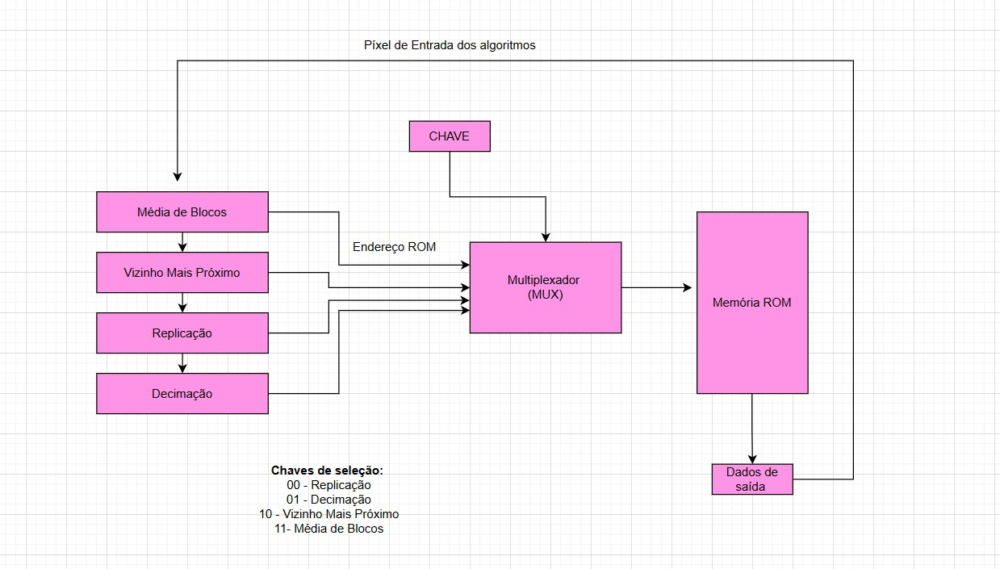
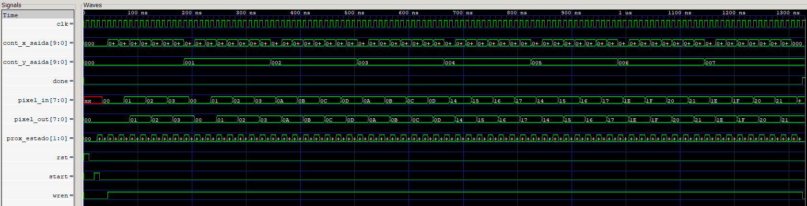
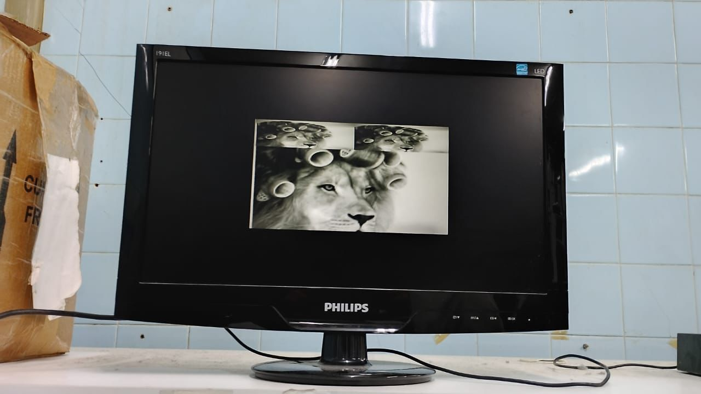

# Coprocessador-de-Imagem

## Sumário

* [Introdução e Definição do Problema](#introdução-e-definição-do-problema)
* [Requisitos Principais](#requisitos-principais)
    * [Aproximação (Zoom in)](#aproximação-zoom-in)
    * [Redução (Zoom out)](#redução-zoom-out)
* [Fundamentação Teórica](#fundamentação-teórica)
    * [Representação Digital da Imagem](#representação-digital-da-imagem)
    * [Algoritmos de Redimensionamento](#algoritmos-de-redimensionamento)
* [Descrição da Solução](#descrição-da-solução)
    * [Arquitetura do Co-processador](#arquitetura-do-co-processador)
    * [Fluxo de Dados](#fluxo-de-dados)
    * [Implementação dos Algoritmos](#implementação-dos-algoritmos)
* [Modo de Uso: Utilizando o Coprocessador](#modo-de-uso-utilizando-o-coprocessador)
* [Explicação dos Testes](#explicação-dos-testes)
* [Conclusão](#conclusão)

## Introdução e Definição do Problema

Este projeto aborda o desenvolvimento de um módulo embarcado de Redimensionamento de Imagens focado em sistemas de vigilância e exibição em tempo real, sob o tema "Zoom Digital: Redimensionamento de Imagens com FPGA em Verilog".

O objetivo principal é projetar e implementar um co-processador gráfico que realize as operações de ampliação (zoom-in) ou redução (zoom-out) de imagens diretamente em hardware. O desenvolvimento é dividido em etapas, e o foco inicial é a construção de um sistema autossuficiente executado inteiramente na FPGA da placa de desenvolvimento DE1-SoC.

Todo o projeto foi desenvolvido utilizando a linguagem Verilog para descrever o hardware e o software de desenvolvimento Quartus Prime versão 23.1 para implementação na placa.

Este co-processador deve simular um comportamento básico de interpolação visual, permitindo o controle das operações através de chaves e botões da placa, e exibindo a imagem processada via saída VGA.

##  Requisitos Principais

O desafio central é a implementação correta dos algoritmos de redimensionamento em linguagem **Verilog**, de forma com que sejam compatíveis com o processador ARM (**HPS - Hard Processor System**) para possibilitar as etapas futuras do projeto. As imagens de entrada e saída são representadas em **escala de cinza**, com cada pixel utilizando **8 bits**.

###  Aproximação (Zoom in)
- **Vizinho Mais Próximo** (Nearest Neighbor Interpolation)
- **Replicação de Pixel** (Pixel Replication / Block Replication)

###  Redução (Zoom out)
- **Decimação / Amostragem** (Nearest Neighbor for Zoom Out)
- **Média de Blocos** (Block Averaging / Downsampling with Averaging)

O sistema só poderá utilizar os componentes disponíveis na placa, sem o uso de processadores externos, com chaves e/ou botões sendo utilizados para determinar a ampliação e redução da imagem.

## Fundamentação Teórica

### Representação Digital da Imagem

Neste projeto, as imagens são tratadas em **escala de cinza**. Cada elemento da imagem, ou **pixel**, é representado por um número inteiro de **8 bits**. Isso significa que cada pixel pode assumir 2⁸ = **256 tonalidades de cinza**, variando de **0 (preto)** a **255 (branco)**.

### Algoritmos de Redimensionamento 

O redimensionamento digital de imagens altera a **resolução** (número de pixels). As operações requeridas são a **ampliação (Zoom in)** e a **redução (Zoom out)**, ambas realizadas em passos de **2X**.

###  Ampliação (Zoom in) - Exemplificação em escala 2X

A ampliação cria uma imagem de saída com **o dobro do tamanho** da imagem original. Para preencher os novos pixels criados, são utilizados métodos básicos de interpolação:

- #### *Vizinho Mais Próximo (Nearest Neighbor Interpolation)*

Para determinar o valor de um pixel na imagem ampliada, o algoritmo copia o valor do pixel **mais próximo** (vizinho mais próximo) da imagem original. O resultado é que um bloco de **2×2 pixels** na nova imagem possuirá o **mesmo valor** do pixel correspondente na imagem original.

- #### *Replicação de Pixel (Pixel Replication)*

Método similar ao Vizinho Mais Próximo, onde cada pixel da imagem original é **replicado** em uma matriz 2×2 na imagem ampliada. É essencialmente uma implementação específica da interpolação por vizinho mais próximo para o caso de ampliação 2X.

###  Redução (Zoom out) - Exemplificação em escala 2X

A redução cria uma imagem de saída com **metade do tamanho** da imagem original. Para selecionar quais pixels serão mantidos ou como combinar a informação, são utilizados os seguintes métodos:

- #### *Decimação / Amostragem (Nearest Neighbor for Zoom Out)*

Método onde apenas **um a cada quatro pixels** (em uma janela 2×2) é selecionado para compor a imagem reduzida. Os demais pixels são descartados, resultando em uma perda de informação seletiva.

- #### *Média de Blocos (Block Averaging)*

Cada bloco de **2×2 pixels** na imagem original é combinado em um **único pixel** na imagem reduzida, onde o valor do novo pixel é a **média aritmética** dos quatro pixels originais.

## Descrição da Solução

### Arquitetura do Co-processador
A arquitetura do sistema é dividida em cinco componentes principais interligados:

  - #### *Unidade de Controle (UnidadeControle.v):* Módulo principal que coordena o fluxo de dados, gerencia a lógica de seleção de algoritmo (via chaves SW) e de fator de escala (via zoom_select), e controla a execução dos módulos de redimensionamento por meio de sinais de start e done.

  - #### *Módulos de Redimensionamento:* Quatro módulos independentes (VizinhoMaisProximo.v, Replicacao.v, Decimacao.v, MediaDeBlocos.v), cada um implementando um dos algoritmos exigidos. Estes módulos são ativados pela Unidade de Controle e utilizam suas próprias Máquinas de Estados Finitos (FSM) para realizar a leitura da ROM e a escrita na RAM.

  - #### *Memória de Imagem Original (ROM):* Armazena a imagem de entrada (160x120 pixels) e é acessada apenas para leitura (via rom_addr).

  - #### *Memória de Imagem Redimensionada (RAM):* Armazena a imagem de saída (redimensionada), sendo acessada para escrita pelos módulos de redimensionamento (via ram_addr e wren) e para leitura pelo driver VGA.

  - #### *Interface de Vídeo (vga_driver.v):* Um driver VGA padrão para gerar os sinais de sincronismo (hsync, vsync) e exibir o conteúdo da memória.

### Fluxo de Dados

O processo tem início quando a Unidade de Controle (UC), em estado de INÍCIO, detecta o sinal de start. A UC lê o seletor SW para determinar o algoritmo a ser executado (Decimação, Replicação, etc.). Um multiplexador de controle direciona um pulso de start_pulse apenas para o módulo de processamento selecionado. Esse módulo, por sua vez, assume o controle dos barramentos de memória e a UC avança para o estado de EXECUÇÃO.

No estado de EXECUÇÃO, o módulo ativo inicia um ciclo contínuo de leitura, processamento e escrita:

- **Leitura:** O módulo calcula o endereço (rom_addr) e solicita o pixel da MemoriaROM, que contém a imagem original.

- **Processamento:** O pixel é transformado de acordo com o algoritmo selecionado.

- **Escrita:** O módulo calcula o endereço de destino (ram_addr) na MemoriaImgRED (uma RAM de porta única) e ativa o sinal de escrita (wren). O pixel resultante é então gravado.

Este ciclo se repete em alta velocidade até que toda a imagem redimensionada esteja completa na RAM. Durante este período, a porta da RAM é dedicada exclusivamente à escrita, suspendendo temporariamente a leitura para exibição VGA.

Ao final do processo, o módulo de processamento envia o sinal done para a UC. A UC, ao detectar esse sinal, desativa a escrita (wren) e ativa a flag exibe_imagem. Essa flag libera a porta da RAM para leitura e um multiplexador de dados direciona a imagem redimensionada para o driver VGA, que a exibe no monitor.

### **Gerenciamento de Memórias e Exibição**

A Unidade de Controle gerencia o acesso às memórias em duas fases distintas, alternando entre processamento e exibição para evitar conflitos de acesso.

 **Operação do Sistema**

- *Durante o Processamento:*
Os algoritmos de redimensionamento controlam o acesso às memórias. A ROM fornece os pixels da imagem original, enquanto a RAM recebe os pixels processados. O algoritmo ativo (selecionado pelas chaves SW) determina os endereços e dados que serão escritos na memória de destino.

Exemplo da multiplexação da memória.

- *Durante a Exibição:*
O driver VGA assume o controle da RAM para leitura, calculando os endereços baseados na posição do pixel sendo renderizado. A escrita na RAM é desabilitada para preservar a integridade dos dados armazenados.

### Controle de Transição

A transição entre os modos é controlada por uma máquina de estados que detecta quando o processamento é concluído e automaticamente habilita o modo de exibição. Isso garante que a imagem só seja mostrada após estar completamente processada, evitando artefatos visuais durante a operação.

### Implementação dos Algoritmos:

#### Algoritmos de Redução (Downscale)

- **Decimação:** O módulo varre todos os pixels da ROM a cada ciclo. A lógica de escrita é implementada com uma condição que ativa o sinal wren somente quando as coordenadas de origem (cont_x_orig, cont_y_orig) são múltiplos exatos do fator de decimação. Assim, o primeiro pixel de cada bloco é amostrado e escrito na RAM, e todos os outros pixels do bloco são lidos e descartados.
  
- **Média de Blocos:** O módulo utiliza uma FSM interna para controlar o fluxo de soma e escrita. Ele lê e acumula o valor de N^2 pixels consecutivos em um registrador soma. Somente após a soma estar completa, o módulo calcula a média aritmética (soma / N^2) e escreve esse único valor na RAM, ativando o wren por apenas um ciclo. O avanço para o próximo bloco de pixels na ROM só ocorre após a escrita do pixel médio.

#### Algoritmos de Ampliação (Upscale)

- **Vizinho Mais Próximo:** Este módulo varre e escreve em todos os endereços da imagem de saída. O endereço de leitura (rom_addr) é calculado em tempo real a partir das coordenadas de saída (cont_x_saida, cont_y_saida) usando divisão inteira pelo fator de zoom. A divisão inteira garante que, para todos os N^2 pixels dentro do bloco de saída, o endereço da ROM sempre aponte para o mesmo pixel de origem. O pixel lido (pixel_in) é continuamente replicado e escrito na RAM.
  
- **Replicação:** O módulo utiliza uma lógica de hold e contadores internos (block_x, block_y). Ele lê um único pixel da ROM e o armazena no registrador pixel_hold. Em seguida, o módulo passa N^2 ciclos de clock repetindo a escrita desse pixel_hold na RAM, avançando apenas os contadores de endereço de destino. O endereço da ROM só é avançado para ler o próximo pixel após o bloco N×N estar totalmente preenchido.

### Modo de Uso: Utilizando o Coprocessador

**Seleção do Algoritmo e Fator de Zoom (Chaves/Switches)**

A escolha do algoritmo e do fator de ampliação/redução é feita através das chaves seletoras (Switches) na placa FPGA. O usuário deve configurar estas chaves antes de disparar a operação:

Seleção do Algoritmo (Sinal SW - Chaves 0 e 1)

O sinal SW de 2 bits define qual dos quatro módulos de processamento será ativado:
| Valor de SW (2 bits) | Algoritmo Selecionado | Tipo de Operação |
| :---: | :---: | :---: |
| 2'b00 | Replicação | Ampliação (Upscale) |
| 2'b01 | Decimação | Redução (Downscale) |
| 2'b10 | Vizinho Mais Próximo | Ampliação (Upscale) |
| 2'b11 | Média de Blocos | Redução (Downscale) |

Seleção do Fator de Redimensionamento (Sinal zoom_select - Chaves 2 e 3)

O sinal zoom_select define o fator de redimensionamento (BLOCK_SIZE_val) que será aplicado ao algoritmo selecionado:
| Valor de zoom_select (2 bits) | Fator de Redimensionamento (X) | Valor da Constante BLOCK_SIZE_val |
| :---: | :---: | :---: |
| 2'b00 | 1x (Padrão/Original) | 1 |
| 2'b01 | 2x | 2 |
| 2'b10 | 4x | 4 |
| 2'b11 | 8x | 8 |

A execução do algoritmo selecionado é disparada por um único botão, que atua como o sinal start. Ao ser pressionado (nível lógico alto), ele dispara a Máquina de Estados Finita (FSM) da UnidadeControle (transição do estado INICIO para EXECUTE).

## Explicação dos Testes

O desenvolvimento se iniciou com a implementação dos algoritmos em Python. Esta etapa inicial foi crucial para o completo entendimento das lógicas de redimensionamento (média, amostragem e replicação). 

Após a conversão das lógicas para os módulos em Verilog, a fase de simulação foi conduzida utilizando o Icarus Verilog. Nesta etapa, foram realizados testes focados em verificar o comportamento funcional de cada módulo, garantindo que a matemática de endereçamento (rom_addr, ram_addr) e a lógica de controle estivessem corretas. 

Exemplo de teste no Icarus Verilog.

A estratégia de teste final concentrou-se na validação direta em hardware. O código foi sintetizado e carregado na placa FPGA, e o foco passou para testes brutos, refatorando o código e observando a saída. O debugging foi feito diretamente ao testar na placa e no VGA. O sucesso foi determinado pelo funcionamento correto dos algoritmos na placa — verificando-se visualmente se a imagem estava sendo ampliada ou reduzida conforme o esperado, se o chaveamento entre os algoritmos (SW) era funcional e se o timing do vga_driver estava sincronizado, validando assim a interação completa do sistema.

Exemplo de teste na FPGA.

## Conclusão

O desenvolvimento do projeto de redimensionamento de imagens em FPGA permitiu aplicar conceitos de sistemas digitais e arquiteturas de computadores na prática, resultando em um coprocessador gráfico funcional capaz de executar operações de zoom in e zoom out por meio dos algoritmos de Vizinho Mais Próximo, Replicação de Pixel, Decimação e Média de Blocos. A implementação em Verilog atendeu à maior parte dos requisitos propostos, incluindo a utilização dos recursos da placa DE1-SoC e a exibição da imagem processada via saída VGA.

Apesar dos avanços obtidos, algumas limitações ficaram evidentes. A integração com o processador ARM, prevista como parte da evolução do projeto, não foi concluída nesta etapa. Além disso, questões de modularização do código e de tempo de compilação indicam que o projeto poderia ser otimizado para maior clareza, reutilização e desempenho. Outro ponto foi o comportamento do reset, que não funcionou conforme o planejado, já que a imagem não retornava ao estado original após o acionamento.

De forma geral, o trabalho cumpriu o papel de consolidar os conhecimentos em circuitos digitais, reforçando a importância do planejamento arquitetural e da organização do código em projetos de hardware. As dificuldades encontradas serviram como aprendizado prático para etapas futuras, em que a conexão com o processador ARM e as melhorias de desempenho poderão ser incorporadas para tornar o sistema mais robusto e escalável.

## Colaboradores
* **Alana Nogueira** - [Alana Nogueira](https://github.com/alananogueeira)
* **Kamilly Matos** - [Kamilly Matos](https://github.com/kamillymatos)
* **Julia Gonçalves** - [Julia Gonçalves](https://github.com/julia-oliver)

## Referências

### Sites

ADAMS, Van Hunter. VGA Driver for DE1-SoC. Disponível em: https://vanhunteradams.com/DE1/VGA_Driver/Driver.html#Verilog-VGA-Driver

INTEL. Cyclone V Device Overview. Disponível em: https://www.intel.com/content/www/us/en/docs/programmable/683694/current/cyclone-v-device-overview.html

TECHNOLOGIES, T. Terasic - SoC Platform - Cyclone - DE1-SoC Board. Disponível em: https://www.terasic.com.tw/cgi-bin/page/archive.pl?Language=English&No=836.

### Livros / Apostilas

PATTERSON, David A.; HENNESSY, John L. Computer Organization and Design: The Hardware/Software Interface, ARM Edition. Amsterdam: Morgan Kaufmann, 2017. ISBN 978-0-12-801733-3

MERRICK, Russell. Getting Started with FPGAs: Digital Circuit Design, Verilog, and VHDL for Beginners. San Francisco: No Starch Press, 2024. ISBN 978-1-7185-0294-9
